# SparkGadget Architecture

Simple architecture notes for the ElectronicStore project.

## 1. System Flow

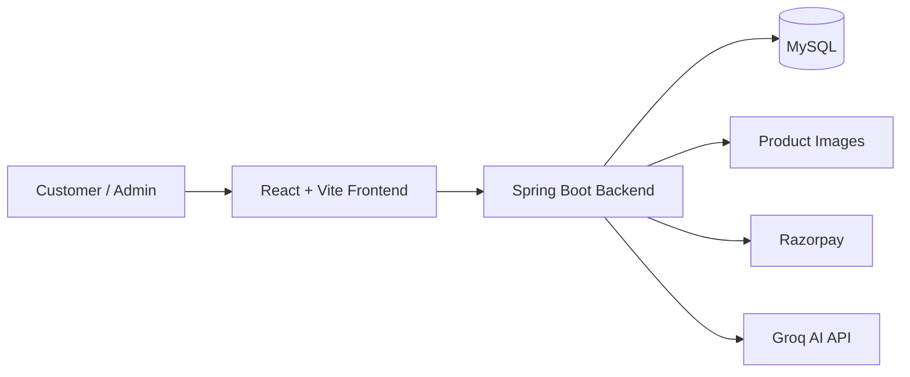

Key notes:

- Frontend: `frontend/`
- Backend: `src/main/java/com/lcwd/electronicStore/ElectronicStore/`
- Config: `src/main/resources/application.properties`
- Frontend API URL comes from `VITE_API_BASE_URL`.
- Secrets must stay in environment variables, not code.

## 2. Code Structure

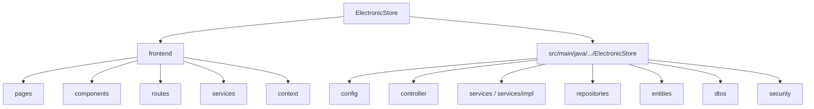

Key notes:

- React pages call files inside `frontend/src/services`.
- Controllers receive API requests.
- Services contain business logic.
- Repositories talk to MySQL.
- DTOs shape request/response data.

## 3. Frontend Startup

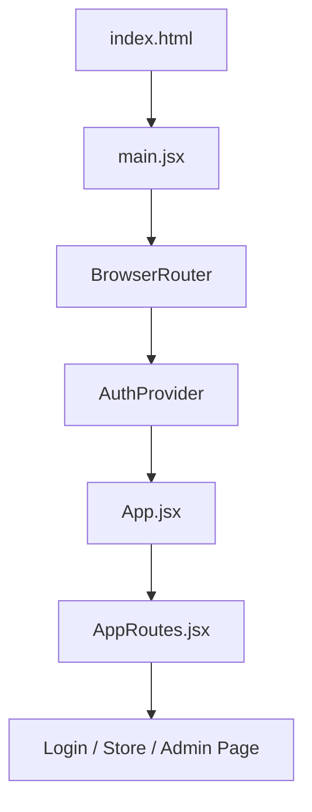

Key notes:

- Routes are in `frontend/src/routes/AppRoutes.jsx`.
- Auth state is in `frontend/src/context/AuthContext.jsx`.
- JWT token is saved in browser `localStorage`.

## 4. Backend Startup

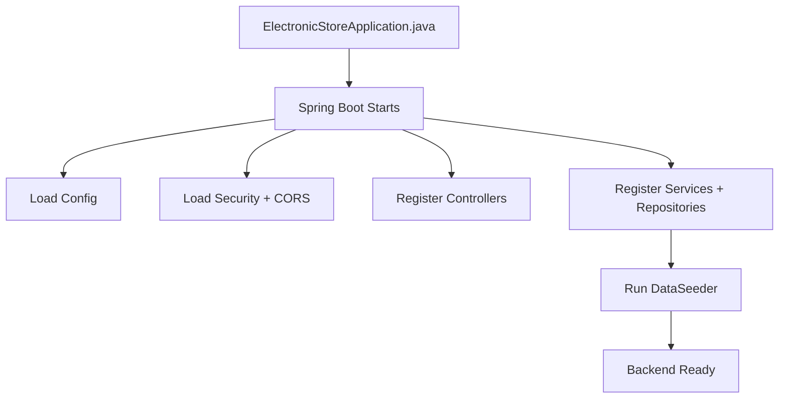

Key notes:

- Railway provides `PORT`; local fallback is `8081`.
- `DataSeeder` adds starter products/categories in a fresh DB.

## 5. Normal API Request Flow

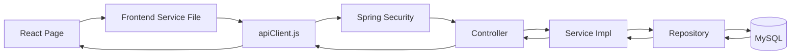

Key notes:

- All frontend API calls should use `frontend/src/services/apiClient.js`.
- `apiClient.js` attaches `Authorization: Bearer <token>` when logged in.
- CORS is configured in `SecurityConfig.java`.

## 6. Login And Security Flow

```mermaid
flowchart TD
    Login[Login / Register UI]
    AuthService[authService.js]
    AuthAPI[/auth APIs]
    AuthController[AuthController]
    UserDetails[CustomUserDetailsService]
    Jwt[JwtHelper]
    BrowserStore[localStorage + AuthContext]
    ProtectedAPI[Protected API Call]
    JwtFilter[JwtAuthenticationFilter]
    Rules[SecurityConfig Rules]
    Guard[SecurityGuard Owner Check]

    Login --> AuthService
    AuthService --> AuthAPI
    AuthAPI --> AuthController
    AuthController --> UserDetails
    AuthController --> Jwt
    Jwt --> BrowserStore
    BrowserStore --> ProtectedAPI
    ProtectedAPI --> JwtFilter
    JwtFilter --> Rules
    Rules --> Guard
```

Key notes:

- `ROLE_USER` opens customer store.
- `ROLE_ADMIN` opens admin dashboard.
- Admin login/register also checks `ADMIN_PORTAL_PASSWORD`.
- `401` usually means missing/expired token.
- `403` usually means wrong role or wrong user ownership.

## 7. Customer Flow

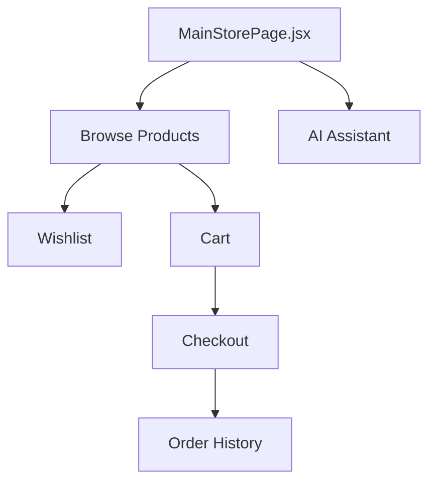

Key notes:

- Public: product/category browsing.
- Logged-in user: cart, wishlist, orders, checkout, assistant.
- Cart and order calculations happen on backend.

## 8. Admin Flow

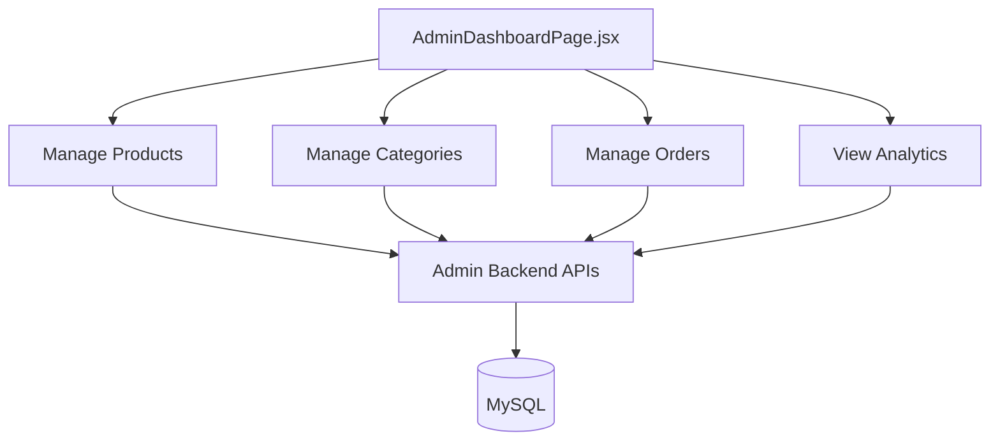

Key notes:

- Admin APIs require `ROLE_ADMIN`.
- Product/category create, update, delete are admin-only.
- Analytics are calculated from order data.

## 9. Payment Flow

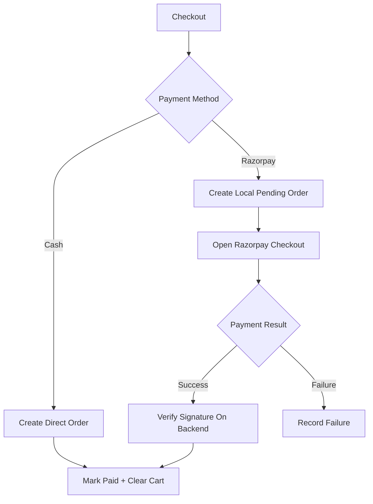

Key notes:

- Razorpay secret key must stay only on backend.
- Payment success is accepted only after backend signature verification.
- Main payment logic is in `OrderServiceImpl`.

## 10. Assistant Flow

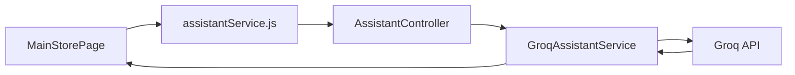

Key notes:

- `GROQ_API_KEY` is backend-only.
- Assistant API requires logged-in user.
- Frontend can fall back to local recommendations if Groq is unavailable.

## 11. Database Relationship Flow

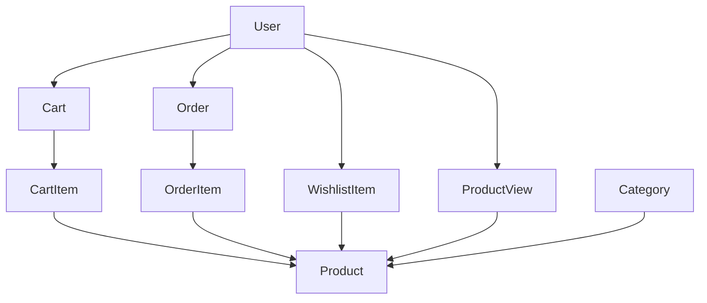

Key notes:

- User owns cart, wishlist, orders, and product views.
- Product belongs to category.
- Cart items and order items connect products with cart/order records.

## 12. Deployment Flow

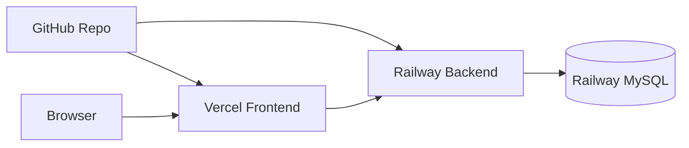

Key notes:

- Vercel root directory: `frontend`
- Vercel build command: `npm run build`
- Vercel output directory: `dist`
- Vercel env: `VITE_API_BASE_URL=https://your-railway-backend-url`
- Railway backend root: project root
- Railway backend needs MySQL and app secret variables.
- Add Vercel domain in backend CORS.

## 13. Debug Flow

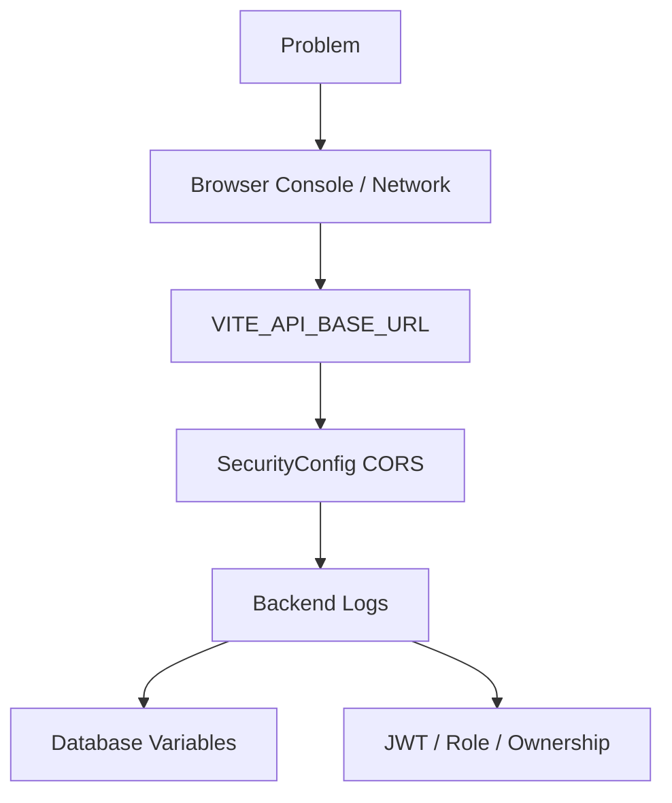

Key notes:

- CORS error: check frontend domain in `SecurityConfig.java`.
- Railway `502`: check latest backend deployment logs.
- Empty products: check database connection and `DataSeeder`.
- Login issue: check JWT secret, role, and admin portal password.
- Payment issue: check Razorpay variables.
- Assistant issue: check Groq variables.

